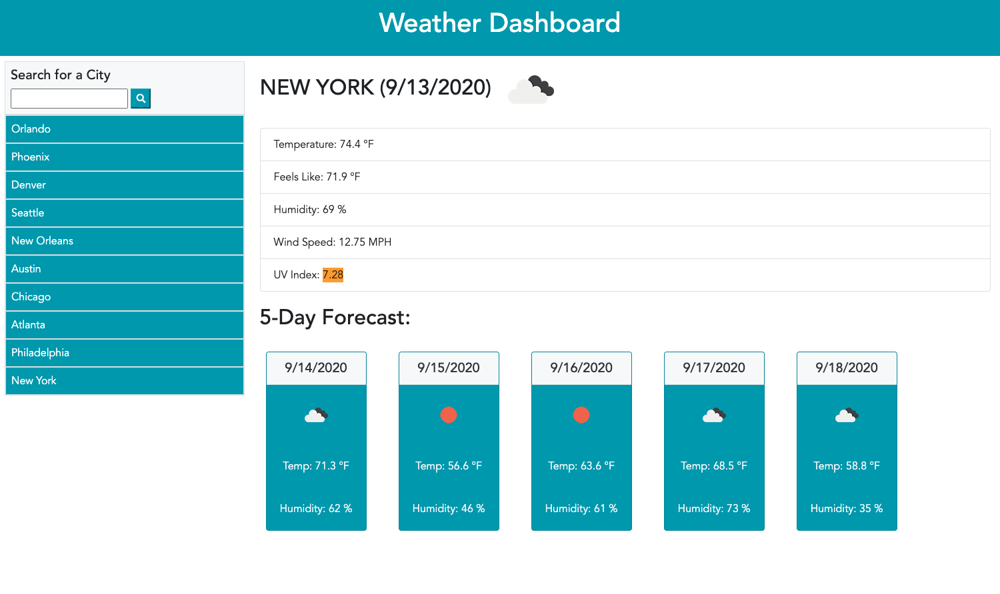

# Create Weather Dashboard
## Description
To create an app for travelers of the world. The user wants to see the weather outlook for multiple cities so that they can plan their trips accordingly.

## Table of Contents
* [Technologies](#technologies)
* [Screenshot](#screenshot)
* [Requirements](#requirements)
* [Additional](#additional)
* [Links](#links)

## Technologies
1. HTML 
2. CSS 
3. JavaScript
4. jQuery
5. Bootstrap
6. Moment.js
7. Font Awesome
8. Third-Party OpenWeather API

## Screenshot

## Requirements
1. The user will utilize the weather dashboard to check out the weather for a particular city of interest. 
2. When the user searches for the city, they are shown current and future conditions for that city and that city is added to the search history.
3. The user is presented with the city name, date, an icon representation of weather conditions, temperature (feels like too), humidity, wind speed and the UV index.
    * When viewing the UV index, the user sees a color that indicates whether the conditions are low, moderate, high or severe. 
4. Below the current weather conditions, the user is shown a 5-day forecast.
    * The 5-day forecast includes the date, an icon representation of weather conditions, temperature and humidity.
5. Lastly, when the user searches for a new city, they can go back to a previously searched city by clicking the name button under the search bar to be shown the current and future weather conditions for that city again.

## Additional
1. This was the first application that I built using an API. The app retrieves data from a third-party weather API called OpenWeather API

## Links
* [Weather Dashboard Deployed Site Link](https://bspiewak6.github.io/weather-dashboard) 
* [Weather Dashboard Github Repository](https://github.com/bspiewak6/weather-dashboard)

